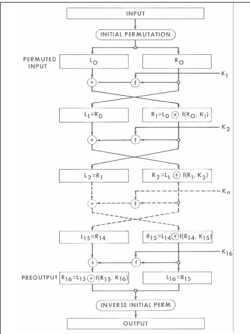
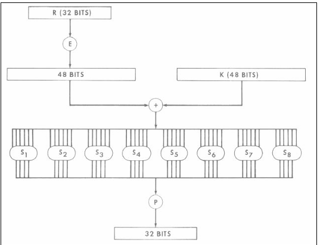
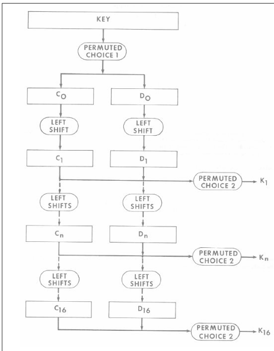

# Data Encryption Standard (DES)

DES is a symmetric-key block cipher developed in the 1970s. It encrypts data in fixed-size blocks of **64 bits** using a **56-bit secret key** with 8 parity bits.

DES works using a **Feistel structure**, where the data is split into two halves and processed through **16 rounds** of substitution and permutation operations. In each round, a different round or sub key (derived from the main key) is used.

---

## Overview

 - Type - Symmetric Block Cipher 
 - Input / Output - 64 bits 
 - Main Key - 64 bits 
 - Sub Key (per round) - 48 bits 
 - Number of Rounds - 16 
 - Structure - Feistel 

---

## Main Steps in DES

1. **Initial Permutation (IP)**
2. **16 Rounds of Processing** (Feistel rounds)
3. **Final Permutation (IP⁻¹)**

---

## 16 Rounds of Processing

After the Initial Permutation, the 64-bit data block is split into two halves:

- **Left half (L₀)** - 32 bits
- **Right half (R₀)** - 32 bits

DES then performs 16 rounds of processing using a Feistel structure.



### For each round i (1 to 16):

1. The right half **Rᵢ₋₁** is **expanded** from 32 bits to 48 bits using the expansion table.
2. The expanded data is **XORed** with the round key **Kᵢ** (48 bits).
3. The result is passed through **8 S-boxes**, reducing it back to 32 bits.
4. A **permutation (P-box)** is applied to the 32-bit output.
5. This result is **XORed** with the left half **Lᵢ₋₁** to produce the new right half **Rᵢ**.
6. The old right half becomes the new left half.

### Round Equations

```
Lᵢ = Rᵢ₋₁
Rᵢ = Lᵢ₋₁ ⊕ F(Rᵢ₋₁, Kᵢ)
```

After 16 rounds, the final halves are swapped and passed through the **Inverse Initial Permutation** to produce the ciphertext.

> This repeated process provides **confusion** and **diffusion**, making DES secure against simple attacks.

---

## The Round Function F

The F-function takes the 32-bit right half and the 48-bit round key as inputs:



| Step | Operation | Bits |
|---|---|---|
| Input | Right half R | 32 |
| Expansion (E) | Expand R | 48 |
| XOR | XOR with round key K | 48 |
| S-boxes (S₁–S₈) | Substitution | 32 |
| P-box (P) | Permutation | 32 |

---

## Key Schedule - Generating 16 Round Keys

DES generates 16 round keys (each 48 bits) from the original 64-bit key by:

1. **Removing parity bits** - 64 bits to 56 bits (via Permuted Choice 1 / PC-1)
2. **Splitting** into two 28-bit halves: **C₀** and **D₀**
3. **Left-shifting** each half every round
4. **Applying PC-2** (Permuted Choice 2) to produce a 48-bit sub key per round



---

## References

[1] NIST, *FIPS PUB 46-3: Data Encryption Standard (DES)*, 1999.  
Available: https://csrc.nist.gov/files/pubs/fips/46-3/final/docs/fips46-3.pdf  

[2] Simplilearn, *What is DES (Data Encryption Standard)?*  
Available: https://www.simplilearn.com/what-is-des-article
