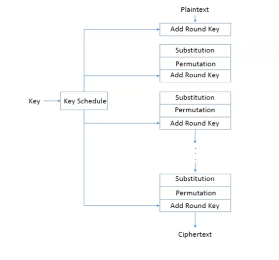

# PRESENT - A Light Weight Cryptography Algorithm

  - an encryption algorithm used in devices with low computing power and limited memory, e.g - smart cards, IoT devices.

  - block cipher, i.e. encryption method that encrypts fixed-size blocks of data.

  - symmetric encryption, that means, it uses a single secret key for both encryption and decryption of data.

### Overview: 

 - symmetric block cipher

 - fixed 64-bit block of data

 - 80-bit or 128-bit key

 - 31 rounds of process

 - Structure: Substitution–Permutation Network (SPN)

NOTE: It was proposed in 2007 and is widely used in lightweight cryptography, Designed by Bogdanov, Knudsen et al.

### Working: 

  Every time PRESENT encrypts data, it runs through 31 identical rounds, then does one final key mix. Each round goes through 3 layers of processes, they are:

1. Key Addition - combines plaintext with the key
2. Substitution - provides confusion
3. Permutation - provides diffusion

Refer the flow diagram

  

### 

### Detailed Explanation:

##### The Key Schedule - Making 32 Round Keys

   PRESENT uses a single 80-bit master key to generate 32 different 64-bit round keys (K1 through K32). This process is called the key schedule.

1. **Extract**: Take the leftmost 64 bits of the current 80-bit key register - that's the round key.

2. **Rotate**: Shift all 80 bits left by 61 positions (same as shifting right by 19 positions).

3. **Substitute**: Run the leftmost 4 bits through the S-box.

4. **Counter XOR**: Mix the round number (1 to 31) into bits 19–15 to prevent repeated patterns.

> **Why 61?** 61 is coprime with 80, so the key visits all 80 positions before repeating. This ensures no two round keys are simple shifts of each other.

##### 1. Key Addition

   - In simple words, XOR (combine with) the 64-bit data block with 64-bit round key derived from the main key. 

   - This makes the data depend on the key.

   - Each time, a part of the secret key - RoundKey Kᵢ generated by the Key Schedule is used.

   NOTE: bit operation xor(^) returns true(1) when different i/p and false(0) when same i/p

##### 

##### 2. Substitution

   - Simply put, 1. splits the 64-bit block into sixteen 4-bit nibbles.
              2. swap each nibble using a secret lookup table (the S-box). 

   - The 4-bit S-box lookup table is:

| x    | 0 | 1 | 2 | 3 | 4 | 5 | 6 | 7 | 8 | 9 | A | B | C | D | E | F |
|------|---|---|---|---|---|---|---|---|---|---|---|---|---|---|---|---|
| S(x) | C | 5 | 6 | B | 9 | 0 | A | D | 3 | E | F | 8 | 4 | 7 | 1 | 2 |

   - This makes the data unpredictable.

**Inverse S-box** *(used in decryption)*:

| x | 0 | 1 | 2 | 3 | 4 | 5 | 6 | 7 | 8 | 9 | A | B | C | D | E | F |
|---|---|---|---|---|---|---|---|---|---|---|---|---|---|---|---|---|
| S⁻¹(x) | 5 | E | F | 8 | C | 1 | 2 | D | B | 4 | 6 | 3 | 0 | 7 | 9 | A |

   - Example: input nibble 0101 (hex 5) → output 0000 (hex 0). This is a substitution - it hides patterns.

##### 

##### 3. Permutation

   - In this, each bit is moved to a new position according to a fixed shuffling pattern.

$$P(i) = (16 \times i) \mod 63 \quad \text{for } i = 0 \text{ to } 62, \quad P(63) = 63$$
     
What this achieves: Bits from different nibbles get mixed together, so a change in one nibble affects many nibbles in the next round (this is called diffusion).

Example Mapping

| Input bit | Output position |
|-----------|-----------------|
| 0         | 0               |
| 1         | 16              |
| 2         | 32              |
| 3         | 48              |

Concretely:
- Bit 0 of nibble 0 → bit 0 of output nibble 0
- Bit 0 of nibble 1 → bit 1 of output nibble 0
- Bit 0 of nibble 2 → bit 2 of output nibble 0
- Bit 0 of nibble 3 → bit 3 of output nibble 0

> The permutation is applied in every round *except the last*, where only the final key XOR (K32) is applied.

## Decryption

Since PRESENT is symmetric, decryption uses the **same 32 round keys** but applied in **reverse order** with inverse operations:

1. XOR with K32 (undo the final key mix)
2. For rounds 31 down to 1:
   - **Inverse Permutation** — reverse the bit shuffle
   - **Inverse Substitution** — apply S⁻¹ to all 16 nibbles
   - **Key Addition** — XOR with round key Kᵢ

